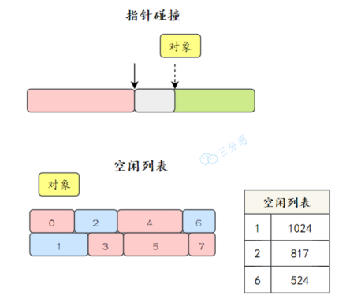
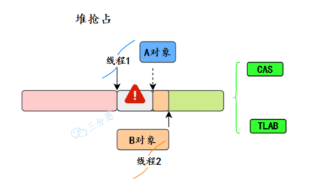
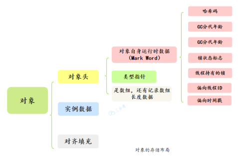
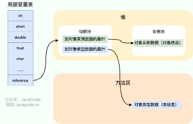
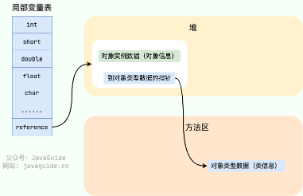

HotSpot是Sun Microsystems（现为 Oracle Corporation 的一部分）开发的一款高性能的Java虚拟机（JVM）实现。它是当前最流行的Java虚拟机之一，广泛应用于各种Java应用程序中，从桌面应用到大型企业级服务端应用。

HotSpot的设计目的是**通过动态编译和优化技术，提高Java应用程序的执行效率**。

# 一、对象的创建

## 1.1 类加载检查
   
虚拟机遇到一条 new 指令时，首先将去检查这个指令的参数是否能在常量池中定位到这个类的符号引用，并且检查这个符号引用代表的类是否已被加载过、解析和初始化过。如果没有，那必须先执行相应的类加载过程。

## 1.2 分配内存

在类加载检查通过后，接下来虚拟机将为新生对象分配内存。对象所需的内存大小在类加载完成后便可确定，为对象分配空间的任务等同于把一块确定大小的内存从 Java 堆中划分出来。分配方式有 **“指针碰撞”** 和 **“空闲列表”** 两种，选择哪种分配方式由 Java 堆是否规整决定，而 Java 堆是否规整又由所采用的垃圾收集器是否带有压缩整理功能决定。

⚠️ **内存分配方式有两种：指针碰撞、空闲列表。**

- 指针碰撞：假设Java堆中内存是绝对规整的，所有被使用过的内存都被放在一边，空闲的内存被放在另一边，中间放着一个指针作为分界点的指示器，那所分配内存就仅仅是把那个指针向空闲空间方向挪动一段与对象大小相等的举例，这种分配方式称为“指针碰撞”。
- 空闲列表：如果Java堆中的内存并不是规整的，已被使用的内存和空闲的内存相互交错在一起，那就没有办法简单地进行指针碰撞了，虚拟机就必须维护一个列表，记录上哪些内存块是可用的，在分配地时候从列表中找到一块足够大的空间划分给对象实例，并更新列表上的记录，这种分配方式称为“空闲列表”。

两种方式的选择由Java堆是否规整决定，Java堆是否规整是由选择的垃圾收集器是否具有压缩整理能力决定的。

⚠️ **内存分配并发问题**

JVM里new对象时，堆会发生抢占码？JVM时怎么设计来保证线程安全的？

会，假设JVM虚拟机上，每⼀次new对象时，指针就会向右移动⼀个对象size的距离，⼀个线程正在给A对象分配内存，指针还没有来的及修改，另⼀个为B对象分配内存的线程，又引⽤了这个指针来分配内存，这就发⽣了抢占。

有两种可选⽅案来解决这个问题：

- CAS+失败重试：CAS是乐观锁的一种实现方式，每次不加锁而是假设没有冲突而去完成某项操作，如果因为冲突失败就重试，直到成功位置。虚拟机采用CAS+失败重试的方式保证更新操作的原子性。
- 每个线程在Java堆中预先分配一小块内存，也就是本地线程分配缓冲（Thread Local Allocation Buffer，TLAB）。JVM在给线程中的对象分配内存时，首先在TLAB分配，当对象大于TLAB中的剩余内存或TLAB的内存已用尽时，再采用CAS+失败重试进行分配。

## 1.3 初始化零值

内存分配完成后，虚拟机需要将分配到的内存空间都初始化为零值（不包括对象头），这一步操作保证了对象的实例字段在Java代码中可以不赋初始值就直接使用，程序能访问到这些字段的数据类型所对应的零值。

## 1.4 设置对象头

初始化零值完成之后，虚拟机要对对象进行必要的设置，例如这个对象是哪个类的实例、如何才能找到类的元数据信息、对象的哈希码、对象的GC分代年龄等信息。 这些信息存放在对象头中。 另外，根据虚拟机当前运行状态的不同，如是否启用偏向锁等，对象头会有不同的设置方式。

## 1.5 执行init方法

在上面工作都完成之后，从虚拟机的视角来看，一个新的对象已经产生了，但从Java程序的视角来看，对象创建才刚开始，init方法还没有执行，所有的字段都还为零。所以一般来说，执行new指令之后会接着执行init方法，把对象按照程序员的意愿进行初始化，这样一个真正可用的对象才算完全产生出来。

# 二、对象的内存布局

在Hotspot虚拟机中，对象在内存中的布局可以分为3块区域：对象头（Header）、实例数据（Instance Data）和对齐填充（Padding）。

对象头包括两部分信息：
- 标记字段（Mark Word）：用于存储对象自身的运行时数据， 如哈希码（HashCode）、GC分代年龄、锁状态标志、线程持有的锁、偏向线程ID、偏向时间戳等等。
- 类型指针（Klass Word）：对象指向它的类元数据的指针，虚拟机通过这个指针来确定这个对象是哪个类的实例。

实例数据⽤来存储对象真正的有效信息，也就是我们在程序代码⾥所定义的各种类型的字段内容，⽆论是从⽗类继承的，还是⾃⼰定义的。

对齐填充部分不是必然存在的，也没有什么特别的含义，仅仅起占位作用。因为Hotspot虚拟机的自动内存管理系统要求对象起始地址必须是8字节的整数倍，换句话说就是对象的大小必须是8字节的整数倍。而对象头部分正好是8字节的倍数（1 倍或 2 倍），因此，当对象实例数据部分没有对齐时，就需要通过对齐填充来补全。

# 三、对象的访问定位

Java程序会通过栈上的reference数据来操作堆上的具体对象。由于reference类型在《Java虚拟机规范》⾥⾯只规定了它是⼀个指向对象的引⽤，并没有定义这个引⽤应该通过什么⽅式去定位、访问到堆中对象的具体位置，所以对象访问⽅式也是由虚拟机实现⽽定的，主流的访问⽅式主要有**使⽤句柄和直接指针**两种：

**句柄**

如果使⽤句柄访问的话，Java堆中将可能会划分出⼀块内存来作为句柄池，reference中存储的就是对象的句柄地址，⽽句柄中包含了对象实例数据与类型数据各⾃具体的地址信息：

**直接指针**

如果使⽤直接指针访问的话，Java堆中对象的内存布局就必须考虑如何放置访问类型数据的相关信息，reference中存储的直接就是对象地址，如果只是访问对象本⾝的话，就不需要多⼀次间接访问的开销：

>这两种对象访问⽅式各有优势：
> 1. 使⽤句柄来访问的最⼤好处就是reference中存储的是稳定句柄地址，在对象被移动（垃圾收集时移动对象是⾮常普遍的⾏为）时只会改变句柄中的实例数据指针，⽽reference本⾝不需要被修改。
>2. 使⽤直接指针来访问最⼤的好处就是速度更快，它节省了⼀次指针定位的时间开销，由于对象访问在Java中⾮常频繁，因此这类开销积少成多也是⼀项极为可观的执⾏成本。

> HotSpot虚拟机主要使⽤**直接指针**来进⾏对象访问。
 