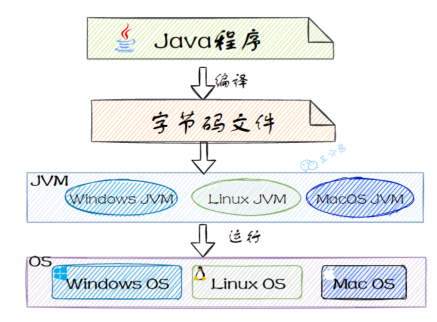
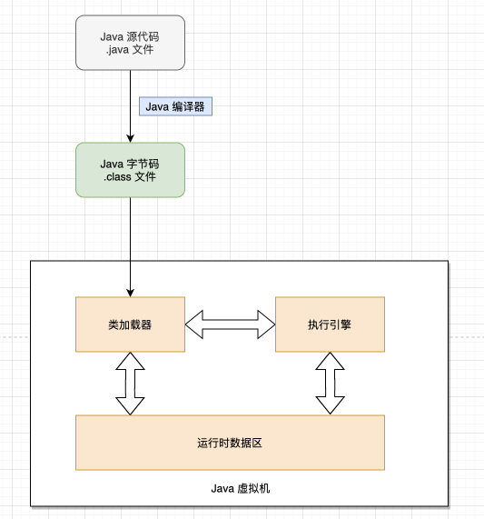
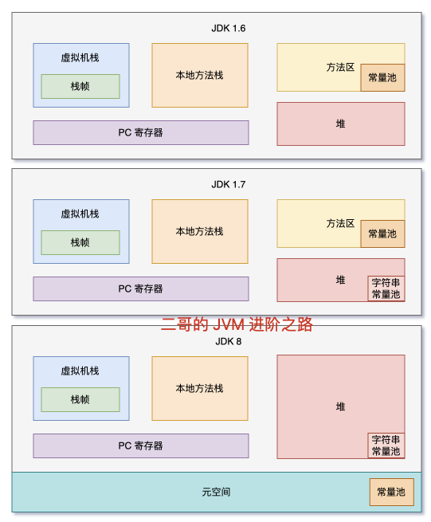
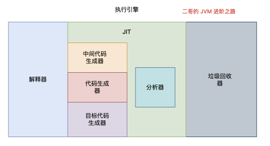

### 一、什么是JVM？
JVM（Java Virtual Machine）是Java语言的运行环境。Java程序运行的时候，编译器将Java文件编译成平台无关的Java字节码文件（.class）：

JVM也是一个跨语言的平台，和语言无关，只和class的文件格式关联。任何语言，只要能翻译成符合规范的字节码文件，都能被JVM运行。

JVM大致可以划分为三个部分：**类加载器、运行时数据区、执行引擎**。

### 二、JVM划分的三个部分

- 类加载器：负责将字节码文件加载到内存中，主要经历"加载->连接->实例化"三个阶段。
- 运行时数据区：定义了Java程序运行期间需要使用到的内存区域，包括方法区、堆、栈、本地方法栈等。垃圾收集器也会针对运行时数据区进行对象回收的工作。同时，针对JDK不同版本的不同，也会对运行时数据区进行一些优化。
    
- 执行引擎：负责将字节码文件翻译成机器码，并执行。
    

### 三、JVM是怎样运行Java代码的？

