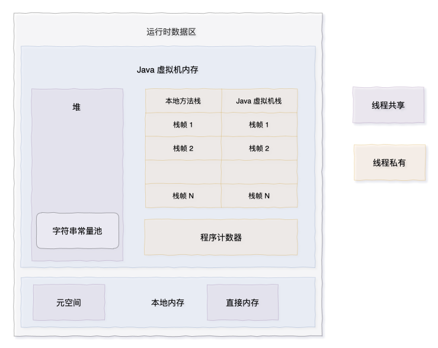
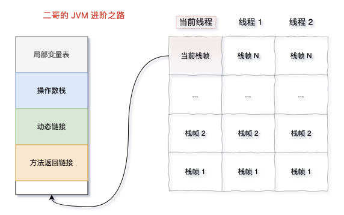
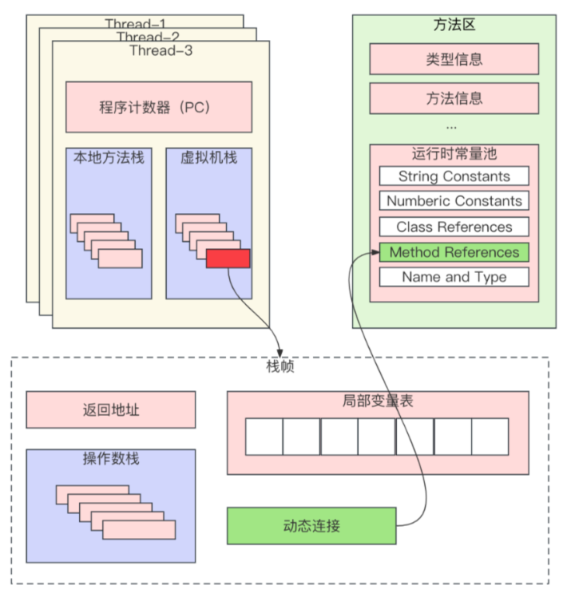

Java的源码文件经过编译后会生成字节码文件，然后由JVM类加载器进行加载，再交给执行引擎执行。在执行过程中，JVM会画出一块内存空间在存储程序执行期间所需要用到的数据，这块空间一般称为运行时数据区。

栈帧是运行时数据区中用于支持虚拟机进行方法调用和方法执行的数据结构。每个方法从调用开始到执行完成，都对应着一个栈帧在虚拟机栈/本地方法栈里从入栈到出栈的过程。

栈帧结构如下：

栈帧中存储了当前线程正在执行的方法的局部变量表、操作数栈、动态连接、方法返回地址等信息。

## 一、局部变量表

局部变量表用来保存方法中的局部变量，以及方法参数。当Java源代码文件被编译成class文件的时候，局部遍历表的最大容量就已经确定了。

局部变量表的大小并不是方法中所有局部变量的数量之和，它与变量的类型和变量的作用域有关。当一个局部变量的作用域结束了，它占用的局部变量表中的位置就被接下来的局部变量取代了。

## 二、操作数栈

同局部遍历表一样，操作数栈的最大深度也在编译的时候就确定了。当一个方法刚开始执行的时候，操作数栈是空的，在方法的执行过程中，会有各种字节码指令往操作数栈中写入和取出数据，也就是入栈和出栈操作。

## 三、动态链接

每个栈帧都包含了一个指向**运行时常量池**中该栈帧所属方法的引用，持有这个引用是为了支持方法调用过程中的动态链接。

>Java重写会根据方法接收者的时机类型来选择方法的版本，这个过程就是Java重写的本质。把这种在运行期根据时机类型确定方法指向版本的过程称为动态链接。

## 四、方法返回地址
当一个方法开始执行后，只有两种方式可以退出这个方法：

1. 正常退出，可能会有返回值传递给上层的方法调用者，方法是否有返回值以及返回值的类型根据方法返回的指令来决定，像之前提到的 ireturn 用于返回 int 类型，return 用于 void 方法；还有其他的一些，lreturn 用于 long 型，freturn 用于 float，dreturn 用于 double，areturn 用于引用类型。
2. 异常退出，方法在执行的过程中遇到了异常，并且没有得到妥善的处理，这种情况下，是不会给它的上层调用者返回任何值的。
无论是哪种方式退出，在方法退出后，都必须返回到方法最初被调用时的位置，程序才能继续执行。一般来说，方法正常退出的时候，PC 计数器的值会作为返回地址，栈帧中很可能会保存这个计数器的值，异常退出时则不会。

>PC 计数器：JVM 运行时数据区的一部分，跟踪当前线程执行字节码的位置。

方法退出的过程实际上等同于把当前栈帧出栈，因此接下来可能执行的操作有：恢复上层方法的局部变量表和操作数栈，把返回值（如果有的话）压入调用者栈帧的操作数栈中，调整 PC 计数器的值，找到下一条要执行的指令等

# 小结
栈帧是 JVM 中用于方法执行的数据结构，每当一个方法被调用时，JVM 会为该方法创建一个栈帧，并在方法执行完毕后销毁。

>- 局部变量表：存储方法的参数和局部变量，由基本数据类型或对象引用组成。 
>- 操作数栈：后进先出（LIFO）的栈结构，用于存储操作数和中间计算结果。 
>- 动态链接：关联到方法所属类的运行时常量池，支持动态方法调用。 
>- 方法返回地址：记录方法结束后控制流应返回的位置。

栈帧是线程私有的，每个线程有自己的 JVM 栈。方法调用时，新栈帧被推入栈顶；方法完成后，栈帧出栈。

栈帧的局部变量表的大小和操作数栈的最大深度在编译时就已确定。栈空间不足时可能引发 StackOverflowError。理解栈帧对于深入理解 Java 程序的运行机制至关重要。

