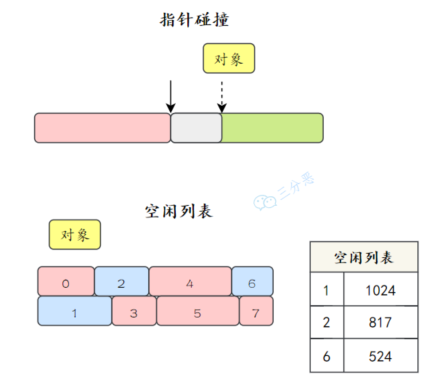

Java源代码文件经过编译器编译后会生成字节码文件，经过加载器加载完毕后会交给执行引擎执行。在执行的过程中，JVM会划出来一块空间来存储程序执行期间需要用到的数据，这块空间就被称为运行时数据区。

运行时数据区可以分为以下几个部分：
- 程序计数器
- Java虚拟机栈
- 本地方法栈
- 堆
- 方法区

# 一、程序计数器

在JVM中，多线程是通过线程轮流切换来获得CPU执行时间的，因此，在任一具体时刻，一个CPU的内核只会执行一条线程中的指令。那么，为了线程切换后能够恢复到正确的执行位置，每个线程都需要有一个独立的程序计数器，并且不能互相干扰，否则就会影响到程序的正常执行次序。

程序计数器主要有两个作用：
1. 字节码解释器通过改变程序计数器来依次读取指令，从而**实现代码的流程控制**，如：顺序执行、选择、循环、异常处理。
2. 在多线程的情况下，程序计数器用于**记录当前线程执行的位置**，从而当线程被切换回来的时候能够知道该线程上次运行到哪儿了。

⚠️ **注意**：程序计数器是唯一一个不会出现OutOfMemoryError的内存区域，它的生命周期随着线程的创建而创建，随着线程的结束而死亡。

# 二、Java虚拟机栈

Java虚拟机栈中是一个个栈帧，每个栈帧对应一个被调用的方法。当线程执行一个方法时，会创建一个对应的栈帧，并将栈帧压入栈中。当方法执行完毕后，将栈帧从栈中移除。

# 三、本地方法栈

本地方法栈与Java虚拟机栈类似，只是Java虚拟机栈为虚拟机执行Java方法服务，而本地方法栈则为虚拟机使用到的native方法服务。

# 四、堆

堆时所有线程共享的一块内存区域，在JVM启动的时候创建，用来存储对象（数组也是一种对象）。

之前，Java中几乎所有的对象都会在堆中分配，但随着JIT编译器的发展和逃逸技术的逐渐成熟，所有的对应都分配到堆上渐渐变得不那么绝对了，从JDK7开始，Java虚拟机已经默认开启逃逸分析了，意味着如果某些方法中的对象引用没有被返回或者未被外面使用（未逃逸出去），那么对象可以直接在栈上分配内存。

为了优化Java的性能 ，JVM在解释器之外引入了JIT编译器：当程序运行时，解释器首先发挥作用，代码可以直接执行。随着时间推移，即时编译器逐渐发挥作用，把越来越多的代码编译优化成本地代码，来获取更高的执行效率。解释器这时可以作为编译运行的降级手段，在一些不可靠的编译优化出现问题时，再切换回解释执行，保证程序可以正常运行。

逃逸分析（Escape Analysis）是一种编译器优化技术，用于判断对象的作用域和生命周期。如果编译器确定一个对象不会逃逸出方法或线程的范围，它可以选择在栈上分配这个对象，而不是在堆上。这样做可以减少垃圾回收的压力，并提高性能。

# 五、元空间和方法区

方法区是Java虚拟机规范上的一个逻辑区域，在不同的JDK版本上有着不同的实现。

在JDK7时，方法区被称为永久代；JDK8时，永久代被彻底移除，取而代之的是元空间。

- JDK7之前，只有常量池的概念，都在方法区中。 
- JDK7的时候，字符串常量池从方法区中拿出来放到了堆中，运行时常量池还在方法区中（也就是永久代中）。 
- JDK8的时候，HotSpot移除了永久代，取而代之的是元空间。字符串常量池还在堆中，而运行时常量池跑到了元空间。

>运行时常量池：在运行期间，JVM会将字节码文件中的常量池加载到内存中，存放在运行时常量池中。
> 字符串常量池：存放字符串常量，也就是在代码中写的字符串，存放在堆中。

# 六、指针碰撞和空闲列表

**内存分配方式有两种：指针碰撞、空闲列表。**

- 指针碰撞：假设Java堆中内存是绝对规整的，所有被使用过的内存都被放在一边，空闲的内存被放在另一边，中间放着一个指针作为分界点的指示器，那所分配内存就仅仅是把那个指针向空闲空间方向挪动一段与对象大小相等的举例，这种分配方式称为“指针碰撞”。
- 空闲列表：如果Java堆中的内存并不是规整的，已被使用的内存和空闲的内存相互交错在一起，那就没有办法简单地进行指针碰撞了，虚拟机就必须维护一个列表，记录上哪些内存块是可用地，在分配地时候从列表中找到一块足够大的空间划分给对象实例，并更新列表上的记录，这种分配方式称为“空闲列表”。

两种方式的选择由Java堆是否规整决定，Java堆是否规整是由选择的垃圾收集器是否具有压缩整理能力决定的。