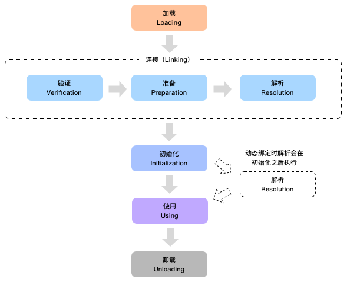
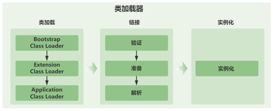

### 一、类的加载过程

类被加载到JVM开始，到卸载出内存，整个生命周期分为七个阶段，分别是：**加载、验证、准备、解析、初始化、使用、卸载**。其中，验证、准备、解析这三个阶段统称为连接。



####  1.1 加载（Loading）

JVM在该阶段会将字节码从不同的数据源（class文件、jar包、网络等）转化为二进制字节流加载到内存中（将字节流转化为方法区的运行时数据结构）（注意，这时就会对文件格式进行验证了，验证通过后才会将字节流转化为运行时数据结构），并生成一个代表该类的java.lang.class对象（作为这个类的数据访问入口）。

#### 1.2 验证（Verification）

JVM 会在该阶段对二进制字节流进行校验，只有符合JVM字节码规范的才能被JVM正确执行。**该阶段是保证JVM安全的重要屏障**，下面是一些主要的检查：


1. 确保二进制字节流格式符合预期（比如说是否以cafe bene开头，前面提到过）。
2. 是否所有方法都遵守访问控制关键字的限定，protected、private那些。
3. 方法调用的参数个数和类型是否正确。
4. 确保变量在使用之前被正确初始化了。
5. 检查变量是否被赋予恰当类型的值。 
6. ...


#### 1.3 准备（Preparation）

JVM会在该阶段对**类变量**（也称为静态变量，static 关键字修饰的）分配内存并初始化，对应数据类型的默认初始值，如0、0L、null、false等。

```java
public String chenmo = "沉默";
public static String wanger = "王二";
public static final String cmower = "沉默王二";
```

chenmo 不会被分配内存，而 wanger 会；但 wanger 的初始值不是“王二”而是 null。

需要注意的是，static final修饰的变量被称作为常量，和类变量不同。常量一旦赋值就不会改变了，所以cmower在准备阶段的值为“沉默王二”而不是null。

> 1. 静态变量的初始化在准备阶段完成，但不会赋初始值。
> 2. 常量的赋值在准备阶段完成，并赋值。

#### 1.4 解析（Resolution）

JVM会在该阶段**将常量池中的符号引用转化为直接引用**，符号引用是指对类、接口、字段、方法、数组组件类型的符号引用，直接引用是指直接指向具体内存位置的引用。

**符号引用**

- 定义：包含了类、字段、方法、接口等多种符号的全限定名。
- 特点：在编译时生成，存储在编译后的字节码文件的常量池中。
- 独立性：不依赖于具体的内存地址，提供了更好的灵活性。

**直接引用**

- 定义：直接指向目标的指针、相对偏移量或者能间接定位到目标的句柄。
- 特点：在运行时生成，依赖于具体的内存布局。
- 效率：由于直接指向了内存地址或者偏移量，所以通过直接引用访问对象的效率较高。

Java本身是一个静态语言，但后面又加入了动态加载特性，因此可以理解解析阶段需要从这两方面来考虑（到底什么时机去解析，是不确定的）。

如果不涉及动态加载，那么一个符号的解析结果是可以缓存的，这样可以避免多次解析同一个符号，因为第一次解析成功后面多次解析也必然成功，第一次解析异常后面重新解析也会是同样的结果。

如果使用了动态加载，前面使用动态加载解析过的符号后面重新解析结果可能会不同。

使用动态加载时解析过程发生在在程序执行到这条指令的时候，这就是为什么前面讲的动态加载时解析会在初始化后执行。


>整个解析阶段主要做了下面几个工作： 
> 1. 类或接口的解析 
> 2. 类方法解析 
> 3. 接口方法解析 
> 4. 字段解析

#### 1.5 初始化（Initialization）

该阶段是类加载过程的最后一步。在准备阶段，类变量已经被赋过默认初始值，而在初始化阶段，**类变量将被赋值为代码期望赋的值**。

换句话说，**初始化阶段是执行类构造器方法的过程**。


初始化时机包括以下这些：
- 创建类的实例时。
- 访问类的静态方法或静态字段时（除了 final 常量，它们在编译期就已经放入常量池）。
- 使用 java.lang.reflect 包的方法对类进行反射调用时。
- 初始化一个类的子类（首先会初始化父类）。
- JVM 启动时，用户指定的主类（包含 main 方法的类）将被初始化。

####  1.6  类加载过程总结

类加载过程的这几个阶段都是混合进行的：
1. 将二进制全限定类名转化为二进制字节流后，立即进行文件格式验证。
2. 验证通过，将字节流转化为运行时数据结构。
3. 在内存中生成一个class对象，作为数据访问入口。
4. 元数据验证、字节码验证。
5. 分配内存空间、赋初始值。
6. 初始化。


>虚拟机根据需要自行判断解析的具体时机（可以是类加载过程中，也可以是加载结束之后的任何时候）。
>符号引用是在解析之前执行的。

>Java虚拟机规范中提到：加载、验证、准备、初始化的过程是按部就班的开始，但并不是按部就班的结束。

### 二、类加载器

对于任意一个类，都需要由它的类加载器和这个类本身一同确定其在JVM中的唯一性。也就是说，如果两个类的加载器不同，即使两个类来源于同一个字节码文件，那这两个类就必定不相等（比如两个类的 Class 对象不 equals）。




也就是说，类加载器可以分为四种类型：

①、引导类加载器（Bootstrap ClassLoader）：负责加载JVM基础核心类库，如 rt.jar、sun.boot.class.path 路径下的类。

②、扩展类加载器（Extension ClassLoader）：负责加载Java扩展库中的类，例如 jre/lib/ext 目录下的类或由系统属性 java.ext.dirs 指定位置的类。

③、系统（应用）类加载器（System ClassLoader）：负责加载系统类路径java.class.path上指定的类库，通常是你的应用类和第三方库。

④、用户自定义类加载器：Java允许用户创建自己的类加载器，通过继承java.lang.ClassLoader类的方式实现。这在需要动态加载资源、实现模块化框架或者特殊的类加载策略时非常有用。


### 三、双亲委派模型

双亲委派模型（Parent Delegation Model）是Java类加载器使用的一种机制，用于确保Java程序的稳定性和安全性。在这个模型中，类加载器在尝试加载一个类时，首先会委派给其父加载器去尝试加载这个类，只有在父加载器无法加载该类时，子加载器才会尝试自己去加载。

1. 委派给父加载器：当一个类加载器接收到类加载的请求时，它首先不会尝试自己去加载这个类，而是将这个请求委派给它的父加载器。

2. 递归委派：这个过程会递归向上进行，从启动类加载器（Bootstrap ClassLoader）开始，再到扩展类加载器（Extension ClassLoader），最后到系统类加载器（System ClassLoader）。

3. 加载类：如果父加载器可以加载这个类，那么就使用父加载器的结果。如果父加载器无法加载这个类（它没有找到这个类），子加载器才会尝试自己去加载。

4. 安全性和避免重复加载：这种机制可以确保不会重复加载类，并保护Java核心API的类不被恶意替换。

```java
Bootstrap ClassLoader
        ↑
        │
Extension ClassLoader
        ↑
        │
System/Application ClassLoader
        ↑
        │
Custom ClassLoader
```
这种层次关系被称作为双亲委派模型：如果一个类加载器收到了加载类的请求，它会先把请求委托给上层加载器去完成，上层加载器又会委托上上层加载器，一直到最顶层的类加载器；如果上层加载器无法完成类的加载工作时，当前类加载器才会尝试自己去加载这个类。

使用双亲委派模型有一个很明显的好处，那就是Java类随着它的类加载器一起具备了一种带有优先级的层次关系，这对于保证Java程序的稳定运作很重要。

上文中曾提到，如果两个类的加载器不同，即使两个类来源于同一个字节码文件，那这两个类就必定不相等——双亲委派模型能够保证同一个类最终会被特定的类加载器加载。