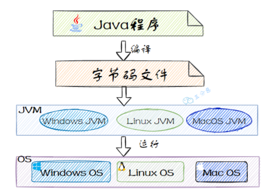
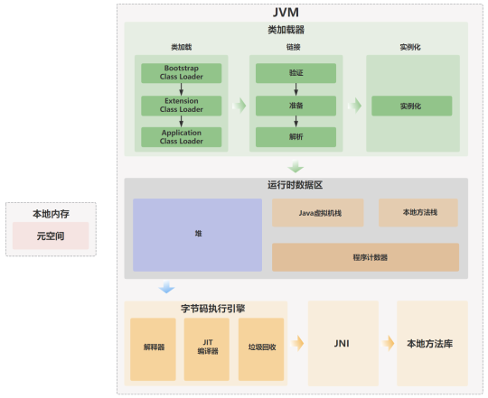

### 一、什么是JVM？
JVM（Java Virtual Machine）是Java语言的运行环境。Java程序运行的时候，编译器将Java文件编译成平台无关的Java字节码文件（.class）：

JVM也是一个跨语言的平台，和语言无关，只和class的文件格式关联。任何语言，只要能翻译成符合规范的字节码文件，都能被JVM运行。

JVM大致可以划分为三个部分：**类加载器、运行时数据区、执行引擎**。

### 二、JVM划分的三个部分

- 类加载器：负责将字节码文件加载到内存中，主要经历"加载->连接->实例化"三个阶段。
- 运行时数据区：定义了Java程序运行期间需要使用到的内存区域，包括方法区、堆、栈、本地方法栈等。垃圾收集器也会针对运行时数据区进行对象回收的工作。同时，针对JDK版本的不同，也会对运行时数据区进行一些优化。
    
- 执行引擎：负责将字节码文件翻译成机器码，并执行。
    

### 三、JVM是怎样运行Java代码的？
通常把Java代码的执行过程分为**编译期**和**运行时**两个阶段。

**编译期**

在编译阶段，Java会将源代码文件编译为字节码文件。

通常情况下，我们只需要安装不同版本的JDK就行了，它里面包含了JRE，JRE里面包含了JVM。

Windows、Linux、MacOS等操作系统都有相应的JDK，只要安装好了JDK就有了Java的运行时环境，就可以把Java源代码编译为字节码，然后字节码又可以在不同的操作系统上运行了。

**运行时**

在运行时阶段，Java字节码文件会被JVM加载，首先会通过类加载器加载字节码文件，然后将字节码加载到JVM的运行时数据区，再通过执行引擎转化为机器码最终交给操作系统执行。

JVM就是靠解释这些字节码指令来完成程序执行的。常见的执行方式有两种：解释执行（对字节码逐条解释执行）和JIT（即时编译），它会在运行时将热点代码优化并缓存起来，下次再执行的时候直接使用缓存起来的机器码，而不需要再次解释执行。

### 四、JVM内存区划分
当类加载器完成字节码数据的加载任务后，JVM划分了专门的内存区域来装载这些字节码数据以及运行时中间数据。

1. PC寄存器、虚拟机栈、本地方法栈属于线程私有的；
2. 堆、元空间(方法区)属于共享数据区，不同的线程共享这部分内存数据。

PC寄存器：

- 如果虚拟机中的当前线程执行的是Java的普通方法，那么PC寄存器中存储的是方法的第一条指令，当方法开始执行之后，PC寄存器存储的是下一个字节码指令的地址。
- 如果虚拟机中的当前线程执行的是native方法，那么PC寄存器中的值为undefined。
- 如果遇到判断分支、循环以及异常等不同的控制转移语句，PC寄存器会被置为目标字节码指令的地址。
- 在多线程切换的时候，虚拟机会记录当前线程的PC寄存器，当线程切换回来的时候会根据此前记录的值恢复到PC寄存器中，来继续执行线程的后续的字节码指令。

**虚拟机栈**：

虚拟机栈操作的基本元素就是栈帧，栈帧中存储了当前线程正在执行的方法的局部变量表、操作数栈、动态连接、方法返回地址等信息。

栈帧是一个先进后出的数据结构，每个方法从调用到执行完成都会对于一个栈帧在虚拟机栈中入栈和出栈。

