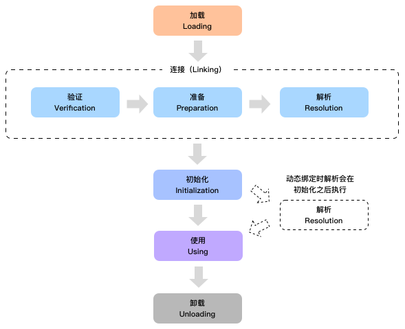
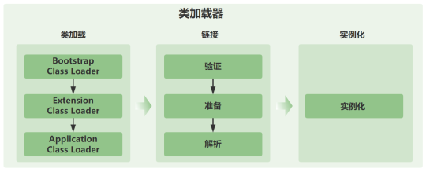
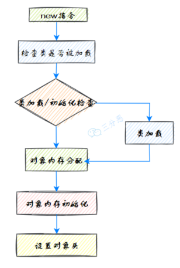

### 一、类的加载过程

类被加载到JVM开始，到卸载出内存，整个生命周期分为七个阶段，分别是：**加载、验证、准备、解析、初始化、使用、卸载**。其中，验证、准备、解析这三个阶段统称为连接。



####  1.1 加载（Loading）

JVM在该阶段会将字节码从不同的数据源（class文件、jar包、网络等）转化为二进制字节流加载到内存中（将字节流转化为方法区的运行时数据结构）（注意，这时就会对文件格式进行验证了，验证通过后才会将字节流转化为运行时数据结构），并生成一个代表该类的java.lang.class对象（作为这个类的数据访问入口）。

#### 1.2 验证（Verification）

JVM 会在该阶段对二进制字节流进行校验，只有符合JVM字节码规范的才能被JVM正确执行。**该阶段是保证JVM安全的重要屏障**，下面是一些主要的检查：


1. 确保二进制字节流格式符合预期（比如说是否以cafe bene开头，前面提到过）。
2. 是否所有方法都遵守访问控制关键字的限定，protected、private那些。
3. 方法调用的参数个数和类型是否正确。
4. 确保变量在使用之前被正确初始化了。
5. 检查变量是否被赋予恰当类型的值。 
6. ...


#### 1.3 准备（Preparation）

JVM会在该阶段对**类变量**（也称为静态变量，static 关键字修饰的）分配内存并初始化，对应数据类型的默认初始值，如0、0L、null、false等。

```java
public String chenmo = "沉默";
public static String wanger = "王二";
public static final String cmower = "沉默王二";
```

chenmo 不会被分配内存，而 wanger 会；但 wanger 的初始值不是“王二”而是 null。

需要注意的是，static final修饰的变量被称作为常量，和类变量不同。常量一旦赋值就不会改变了，所以cmower在准备阶段的值为“沉默王二”而不是null。

> 1. 静态变量的初始化在准备阶段完成，但不会赋初始值。
> 2. 常量的赋值在准备阶段完成，并赋值。

#### 1.4 解析（Resolution）

JVM会在该阶段**将常量池中的符号引用转化为直接引用**，符号引用是指对类、接口、字段、方法、数组组件类型的符号引用，直接引用是指直接指向具体内存位置的引用。

**符号引用**

- 定义：包含了类、字段、方法、接口等多种符号的全限定名。
- 特点：在编译时生成，存储在编译后的字节码文件的常量池中。
- 独立性：不依赖于具体的内存地址，提供了更好的灵活性。

**直接引用**

- 定义：直接指向目标的指针、相对偏移量或者能间接定位到目标的句柄。
- 特点：在运行时生成，依赖于具体的内存布局。
- 效率：由于直接指向了内存地址或者偏移量，所以通过直接引用访问对象的效率较高。

Java本身是一个静态语言，但后面又加入了动态加载特性，因此可以理解解析阶段需要从这两方面来考虑（到底什么时机去解析，是不确定的）。

如果不涉及动态加载，那么一个符号的解析结果是可以缓存的，这样可以避免多次解析同一个符号，因为第一次解析成功后面多次解析也必然成功，第一次解析异常后面重新解析也会是同样的结果。

如果使用了动态加载，前面使用动态加载解析过的符号后面重新解析结果可能会不同。

使用动态加载时解析过程发生在在程序执行到这条指令的时候，这就是为什么前面讲的动态加载时解析会在初始化后执行。


>整个解析阶段主要做了下面几个工作： 
> 1. 类或接口的解析 
> 2. 类方法解析 
> 3. 接口方法解析 
> 4. 字段解析

#### 1.5 初始化（Initialization）

该阶段是类加载过程的最后一步。在准备阶段，类变量已经被赋过默认初始值，而在初始化阶段，**类变量将被赋值为代码期望赋的值**。

换句话说，**初始化阶段是执行类构造器方法的过程**。


初始化时机包括以下这些：
- 创建类的实例时。
- 访问类的静态方法或静态字段时（除了 final 常量，它们在编译期就已经放入常量池）。
- 使用 java.lang.reflect 包的方法对类进行反射调用时。
- 初始化一个类的子类（首先会初始化父类）。
- JVM 启动时，用户指定的主类（包含 main 方法的类）将被初始化。

####  1.6  类加载过程总结

类加载过程的这几个阶段都是混合进行的：
1. 将二进制全限定类名转化为二进制字节流后，立即进行文件格式验证。
2. 验证通过，将字节流转化为运行时数据结构。
3. 在内存中生成一个class对象，作为数据访问入口。
4. 元数据验证、字节码验证。
5. 分配内存空间、赋初始值。
6. 初始化。


>虚拟机根据需要自行判断解析的具体时机（可以是类加载过程中，也可以是加载结束之后的任何时候）。
>符号引用是在解析之前执行的。

>Java虚拟机规范中提到：加载、验证、准备、初始化的过程是按部就班的开始，但并不是按部就班的结束。

### 二、类加载器

对于任意一个类，都需要由它的类加载器和这个类本身一同确定其在JVM中的唯一性。也就是说，如果两个类的加载器不同，即使两个类来源于同一个字节码文件，那这两个类就必定不相等（比如两个类的 Class 对象不 equals）。




也就是说，类加载器可以分为四种类型：

①、引导类加载器（Bootstrap ClassLoader）：负责加载JVM基础核心类库，如 rt.jar、sun.boot.class.path 路径下的类。

②、扩展类加载器（Extension ClassLoader）：负责加载Java扩展库中的类，例如 jre/lib/ext 目录下的类或由系统属性 java.ext.dirs 指定位置的类。

③、系统（应用）类加载器（System ClassLoader）：负责加载系统类路径java.class.path上指定的类库，通常是你的应用类和第三方库。

④、用户自定义类加载器：Java允许用户创建自己的类加载器，通过继承java.lang.ClassLoader类的方式实现。这在需要动态加载资源、实现模块化框架或者特殊的类加载策略时非常有用。


### 三、双亲委派模型

双亲委派模型（Parent Delegation Model）是Java类加载器使用的一种机制，用于确保Java程序的稳定性和安全性。在这个模型中，类加载器在尝试加载一个类时，首先会委派给其父加载器去尝试加载这个类，只有在父加载器无法加载该类时，子加载器才会尝试自己去加载。

1. 委派给父加载器：当一个类加载器接收到类加载的请求时，它首先不会尝试自己去加载这个类，而是将这个请求委派给它的父加载器。

2. 递归委派：这个过程会递归向上进行，从启动类加载器（Bootstrap ClassLoader）开始，再到扩展类加载器（Extension ClassLoader），最后到系统类加载器（System ClassLoader）。

3. 加载类：如果父加载器可以加载这个类，那么就使用父加载器的结果。如果父加载器无法加载这个类（它没有找到这个类），子加载器才会尝试自己去加载。

4. 安全性和避免重复加载：这种机制可以确保不会重复加载类，并保护Java核心API的类不被恶意替换。

```java
Bootstrap ClassLoader
        ↑
        │
Extension ClassLoader
        ↑
        │
System/Application ClassLoader
        ↑
        │
Custom ClassLoader
```
这种层次关系被称作为双亲委派模型：如果一个类加载器收到了加载类的请求，它会先把请求委托给上层加载器去完成，上层加载器又会委托上上层加载器，一直到最顶层的类加载器；如果上层加载器无法完成类的加载工作时，当前类加载器才会尝试自己去加载这个类。

使用双亲委派模型有一个很明显的好处，那就是Java类随着它的类加载器一起具备了一种带有优先级的层次关系，这对于保证Java程序的稳定运作很重要。

上文中曾提到，如果两个类的加载器不同，即使两个类来源于同一个字节码文件，那这两个类就必定不相等——双亲委派模型能够保证同一个类最终会被特定的类加载器加载。

### 四、对象的创建过程

在JVM中，对象的创建是从一个new指令开始：
1. 首先检查这个指令的参数是否能在常量池中定位到一个类的符号引用；
2. 检查这个符号引用代表的类是否已经被加载、解析和初始化过。如果没有，就先执行相应的类加载过程；
3. 类加载检查通过后，虚拟机将为新生对象分配内存；
4. 内存分配完成后，虚拟机将分配到的内存空间（不包括对象头）都初始化为零；
5. 设置对象头，请求头里包含了对象是哪个类的实例、如何才能找到类的元数据信息、对象的哈希码、对象的GC分代年龄等信息。




