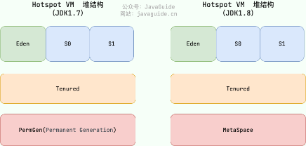
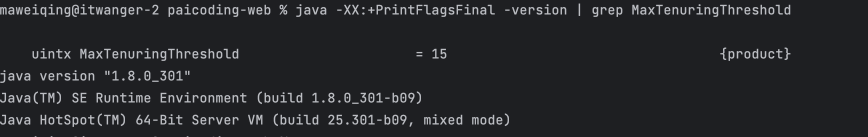
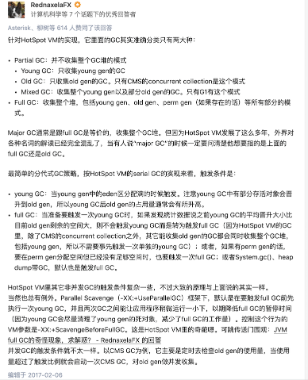
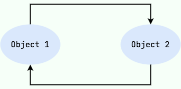
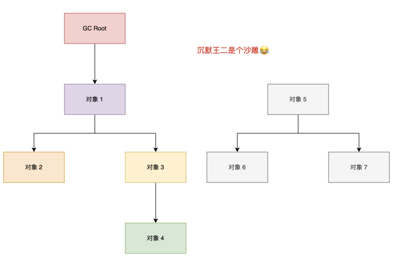
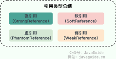
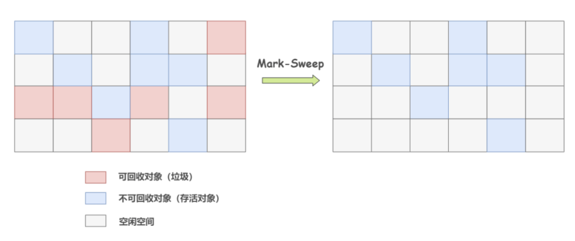
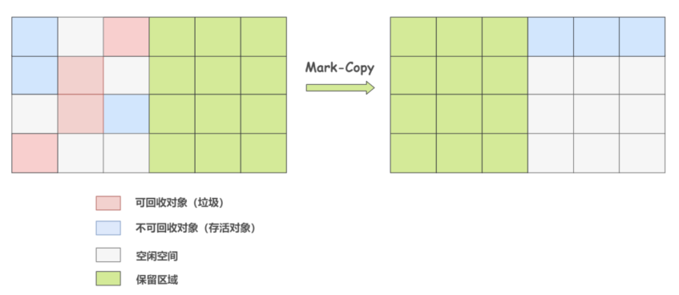
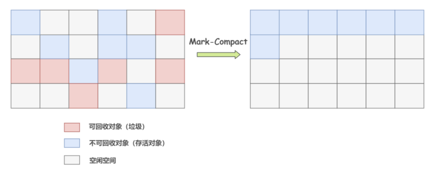
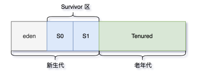

当需要排查各种内存溢出问题、当垃圾收集成为系统达到更高并发的瓶颈时，我们就需要对这些“自动化”的技术实施必要的监控和调节。

# 一、什么是垃圾回收机制？

垃圾回收（Garbage Collection，GC），是一种自动的内存管理机制，它负责回收不再使用的对象（对堆中已经死亡的或长时间没有使用的对象进行清除和回收），从而有效的使用可以使用的内存。

# 二、堆空间的基本结构

Java的自动内存管理主要就是针对对象内存的回收和对象内存的分配。同时，Java自动内存管理最核心的功能是**堆内存中对象的分配与回收**。

Java堆是垃圾收集器管理的主要区域，因此也称作GC堆。

从垃圾回收的角度来说，由于现在收集器基本都采用分代垃圾手机算法，所以Java堆被划分为几个不同的区域，这样就可以根据各个区域的特点来选择合适的垃圾收集算法。

## 2.1 不同JDK版本对应的区域划分
在JDK7版本及JDK7版本之前，堆内存被通常分为三部分：
1. 新生代内存（Young Generation）
2. 老生代（Old Generation）
3. 永久代（Permanent Generation）

在JDK8版本之后，永久代（Permanent Generation）已经被元空间取代，元空间取的是直接内存。



## 2.2 新生代

堆主要分为两个区域：新生代和老年代。其中，新生代又分为Eden区和Survivor区（其中，Survivor区又分为From和To两个区）。

### 01、Eden区

大多数情况下，对象会在新生代Eden区中进行分配，当Eden区没有足够空间进行分配时，JVM会发起一次Minor GC，Minor GC（新生代）相比Major GC（老年代）更频繁，回收速度也更快。

通过Minor GC后，Eden区中绝大部分对象会被回收，而哪些无需回收的存活对象，将会进到Survivor的From区，如果From区不够，则直接进入To区。

### 02、Survivor区

Survivor区相当于是Eden区和Old区的缓冲，类似于交通系统中的黄灯。

这里引申出来两个问题：

**⚠️ 为什么需要Survivor区？**

如果没有Survivor区，Eden区每进行一次Minor GC，存活的对象就会被送到老年代，老年代很快就会被填满。然而，有很多对象虽然一次Minor GC没有被消灭掉，但其实也不会蹦跶太久，可能第二次、第三次就要被清除。

所以，Survivor区存在的意义就是减少被送到老年代的对象，进而减少Major GC的发生。

Survivor的预筛选保证，只有经历16次的Minor GC后还能在新生代中存活的对象，才会被送到老年代。

**⚠️ Survivor区为什么划分为两块？**

最大的好处就是**解决内存碎片化**。每次Minor GC时，会将之前Eden区和From区中存活的对象复制到To区。等到第二次Minor GC时，From与To职责互换，将Eden区和To区中的存活对象再复制到From区，以此反复。

这种机制最大的好处就是，整个过程中，永远有一个Survivor space是空的，另一个非空的Survivor space是无碎片的。

那为什么不分更多块呢？三个？四个？五个？...

如果Survivor区再细分下去，每一块的空间就会比较小，容易导致Survivor区满，两块Survivor区可能是经过权衡之后的最佳方案。

## 2.2 老年代

老年代占据着2/3的堆内存空间，只有在Major GC的时候才会进行清理，每次GC都会触发“Stop-The-World”。内存越大，STW的时间也越长，所以内存也不仅仅是越大越好。

由于复制算法在对象存活率较高的老年代会进行很多次的复制操作，效率很低，所以老年代这里采用的是标记整理算法。

在**内存担保机制**下，无法安置的对象会直接进到老年代，以下几种情况也会进入老年代：
1. 大对象

大对象指需要大量连续内存空间的对象（字符串、数组），这部分对象不管是不是“朝生夕死”，都会直接进到老年代。这样做主要是为了避免在Eden区及2个Survivor区之间发生大量的内存复制。当你的系统有非常多“朝生夕死”的大对象时，得注意了。

大对象直接进入老年代的行为是由虚拟机动态决定的，它与具体使用的垃圾回收器和相关参数有关。大对象直接进入老年代是一种优化策略，旨在避免将大对象放入新生代，从而减少新生代的垃圾回收频率和成本。
- G1 垃圾回收器会根据 -XX:G1HeapRegionSize 参数设置的堆区域大小和 -XX:G1MixedGCLiveThresholdPercent 参数设置的阈值，来决定哪些对象会直接进入老年代。
- Parallel Scavenge 垃圾回收器中，默认情况下，并没有一个固定的阈值(XX:ThresholdTolerance是动态调整的)来决定何时直接在老年代分配大对象。而是由虚拟机根据当前的堆内存情况和历史数据动态决定。

2. 长期存活对象

虚拟机给每个对象定义了一个对象年龄（Age）计数器。正常情况下对象会不断的在Survivor的From区与To区之间移动，对象在Survivor区中每经历一次Minor GC，年龄就增加 1 岁。当年龄增加到15岁时，这时候就会被转移到老年代。当然，这里的15，JVM 也支持进行特殊设置 -XX:MaxTenuringThreshold=10。

可通过 java -XX:+PrintFlagsFinal -version | grep MaxTenuringThreshold 查看默认的阈值。


3. 动态对象年龄

JVM并不强制要求对象年龄必须到15岁才会放入老年区，如果Survivor空间中某个年龄段的对象总大小超过了Survivor空间的一半，那么该年龄段及以上年龄段的所有对象都会在下一次垃圾回收时被晋升到老年代，无需等你“成年”。

有点类似于负载均衡，轮询是负载均衡的一种，保证每台机器都分得同样的请求。看似很均衡，但每台机器的硬件不同，健康状况不同，所以我们可以基于每台机器接收的请求数、响应时间等，来调整负载均衡算法。

这种动态调整机制有助于优化内存使用和减少垃圾收集的频率，特别是在处理大量短生命周期对象的应用程序时。


>内存担保机制：空间分配担保是为了确保在Minor GC之前老年代本身还有容纳新生代所有对象的剩余空间。
> 《深入理解 Java 虚拟机》第三章对于空间分配担保的描述如下：JDK 6 Update 24 之前，在发生 Minor GC 之前，虚拟机必须先检查老年代最大可用的连续空间是否大于新生代所有对象总空间，如果这个条件成立，那这一次 Minor GC 可以确保是安全的。如果不成立，则虚拟机会先查看 -XX:HandlePromotionFailure 参数的设置值是否允许担保失败(Handle Promotion Failure);如果允许，那会继续检查老年代最大可用的连续空间是否大于历次晋升到老年代对象的平均大小，如果大于，将尝试进行一次 Minor GC，尽管这次 Minor GC 是有风险的;如果小于，或者 -XX: HandlePromotionFailure 设置不允许冒险，那这时就要改为进行一次 Full GC。JDK 6 Update 24 之后的规则变为只要老年代的连续空间大于新生代对象总大小或者历次晋升的平均大小，就会进行 Minor GC，否则将进行 Full GC。



# 三、GC的分类

针对HotSpot VM的实现，它里面的GC其实准确分类只有两大种：
- 部分收集 (Partial GC)： 
  - 新生代收集（Minor GC / Young GC）：只对新生代进行垃圾收集；
  - 年代收集（Major GC / Old GC）：只对老年代进行垃圾收集。需要注意的是 Major GC 在有的语境中也用于指代整堆收集；
  - 混合收集（Mixed GC）：对整个新生代和部分老年代进行垃圾收集。
- 整堆收集 (Full GC)：收集整个 Java 堆和方法区。


# 四、垃圾判断算法（死亡对象判断方法）

既然要做垃圾回收，就要搞清楚什么是垃圾，什么不是垃圾（判断哪些对象已经死亡，即不能再被任何途径使用的对象）。

有两种方法；
1. 引用计数算法
2. 可达性分析算法

## 4.1 引用计数算法

给对象中添加一个引用计数器：

- 每当有一个地方引用它，计数器就加 1；
- 当引用失效，计数器就减 1；
- 任何时候计数器为 0 的对象就是不可能再被使用的。

**这个方法实现简单，效率高，但是目前主流的虚拟机中并没有选择这个算法来管理内存，其最主要的原因是它很难解决对象之间循环引用的问题。**



所谓对象之间的相互引用问题，如下面代码所示：除了对象 objA 和 objB 相互引用着对方之外，这两个对象之间再无任何引用。但是他们因为互相引用对方，导致它们的引用计数器都不为 0，于是引用计数算法无法通知 GC 回收器回收他们。

```java
public class ReferenceCountingGc {
    Object instance = null;
    public static void main(String[] args) {
        ReferenceCountingGc objA = new ReferenceCountingGc();
        ReferenceCountingGc objB = new ReferenceCountingGc();
        objA.instance = objB;
        objB.instance = objA;
        objA = null;
        objB = null;
    }
}
`````

## 4.2 可达性分析算法

这个算法的基本思想就是通过一系列的称为 “GC Roots” 的对象作为起点，从这些节点开始向下搜索，节点所走过的路径称为引用链，当一个对象到 GC Roots 没有任何引用链相连的话，则证明此对象是不可用的，需要被回收。下图中的 Object 6 ~ Object 10 之间虽有引用关系，但它们到 GC Roots 不可达，因此为需要被回收的对象。



哪些对象可以作为 GC Roots 呢？
- 虚拟机栈(栈帧中的局部变量表、方法的参数等)中引用的对象
- 本地方法栈(Native 方法)中引用的对象
- 方法区中类静态属性引用的对象
- 方法区中常量（运行时常量池）引用的对象
- 所有被同步锁持有的对象
- JNI（Java Native Interface）引用的对象


对象可以被回收，就代表一定会被回收吗？

即使在可达性分析法中不可达的对象，也并非是“非死不可”的，这时候它们暂时处于“缓刑阶段”，要真正宣告一个对象死亡，至少要经历两次标记过程；可达性分析法中不可达的对象被第一次标记并且进行一次筛选，筛选的条件是此对象是否有必要执行finalize方法。当对象没有覆盖finalize方法，或finalize方法已经被虚拟机调用过时，虚拟机将这两种情况视为没有必要执行。被判定为需要执行的对象将会被放在一个队列中进行第二次标记，除非这个对象与引用链上的任何一个对象建立关联，否则就会被真的回收。

# 五、引用类型

无论是通过引用计数法判断对象引用数量，还是通过可达性分析法判断对象的引用链是否可达，判定对象的存活都与“引用”有关。

JDK1.2之前，Java中引用的定义很传统：如果reference类型的数据存储的数值代表的是另一块内存的起始地址，就称这块内存代表一个引用。

JDK1.2之后，Java对引用的概念进行了扩充，将引用分为强引用、软引用、弱引用、虚引用这四种类型：



## 5.1 强引用（StrongReference）

强引用就是最基本的引用，如果一个对象只被一个强引用所引用，那么这个对象就不会被垃圾回收器回收，类似于**必不可少的生活用品**。当内存空间不足时，Java虚拟机宁愿抛出OutOfMemoryError错误，使程序异常中止，也不会靠随意回收具有强引用的对象来解决内存不足问题。

## 5.2 软引用（SoftReference）

类似于**可有可无的生活用品**。如果内存空间足够，垃圾回收器就不会回收它；如果内存空间不足了，就会回收这些对象的内存。只要垃圾回收器没有回收它，该对象就可以被程序使用。软引用可用来实现内存敏感的高速缓存。

软引用**可以**和一个引用队列（ReferenceQueue）联合使用，如果软引用所引用的对象被垃圾回收，Java虚拟机就会把这个软引用加入到与之关联的引用队列中。

## 5.3 弱引用（WeakReference）

弱引用与软引用类似，都类似于**可有可无的生活用品**，其与软引用的区别在于，如果一个对象只具有弱引用，那么它就和没有任何引用一样，在任何时候都可能被垃圾回收器回收。由于垃圾回收器使一个优先级很低的线程，因此不一定会很快发现那些只具有弱引用的对象。

弱引用**可以**和一个引用队列（ReferenceQueue）联合使用，如果软引用所引用的对象被垃圾回收，Java虚拟机就会把这个弱引用加入到与之关联的引用队列中。

## 5.4 虚引用（PhantomReference）

形同虚设，与其他几种引用都不同，虚引用并不会决定对象的生命周期。如果一个对象仅持有虚引用，那么它就和没有任何引用一样，在任何时候都可能被垃圾回收。

**虚引用主要用来跟踪对象被垃圾回收器回收的活动。**

虚引用与软引用和弱引用的一个区别在于，虚引用不能单独使用。**必须**和引用队列（ReferenceQueue）联合使用。当垃圾回收器准备回收一个对象时，如果发现它还有虚引用，就会在回收对象的内存之前，把这个虚引用加入到与之关联的引用队列中。程序可以通过判断引用队列中是否已经加入了虚引用，来了解被引用的对象是否将要被垃圾回收。程序如果发现某个虚引用已经被加入到引用队列，那么就可以在所引用的对象的内存被回收之前采取必要的行动。


> 在程序设计中，一般很少使用弱引用与虚引用，使用软引用的情况比较多。这是因为软引用可以加速JVM对垃圾内存的回收速度，可以维护系统的运行安全，防止内存溢出等问题的产生。

# 六、垃圾收集算法

## 6.1 标记-清除算法

标记-清除（Mark-and-Sweep）算法分为“标记（Mark）”和“清除（Sweep）”阶段：首先标记出所有不需要回收的对象，在标记完成后统一回收掉所有没有被标记的对象。

它是最基础的收集算法，后续的算法都是对其不足进行改进得到。这种垃圾收集算法会带来两个明显的问题：
1. 效率问题：标记和清除两个过程效率都不高。
2. 空间问题：标记清除后会产生大量不连续的内存碎片。



清理掉的垃圾就变成可使用的空闲空间，等待被再次使用。逻辑清晰，并且也很好操作，但是存在一个很大的问题就是：内存碎片。碎片太多可能会导致当程序运行过程中需要分配较大对象时，因无法找到足够的连续内存而不得不提前触发新一轮的垃圾收集。

关于具体是标记可回收对象（不可达对象）还是不可回收对象（可达对象），众说纷纭，两种说法其实都没问题，我个人更倾向于是后者。

如果按照前者的理解，整个标记-清除过程大致是这样的：
1. 当一个对象被创建时，给一个标记位，假设为 0 (false)；
2. 在标记阶段，我们将所有可达对象（或用户可以引用的对象）的标记位设置为 1 (true)；
3. 扫描阶段清除的就是标记位为 0 (false)的对象。


## 6.2 复制算法

为了解决标记-清除算法的内存碎片问题，复制收集算法出现了，是在标记-清除算法上演化而来的。它将可用内存按容量划分为大小相等的两块，每次只使用其中的一块。当这一块的内存使用完后，就将还存活的对象复制到另一块去，然后再把使用的空间一次清理掉。这样就使每次的内存回收都是对内存区间的一半进行回收。


虽然改进了标记-清除算法，但依然存在问题：
- 可用内存变小：可用内存缩小为原来的一半
- 不适合老年代：如果存活对象数量比较大，复制性能会变得很差

## 6.3 标记-整理算法

标记-整理算法是根据老年代的特点提出的一种标记算法，标记过程仍然与标记-清除算法一样，但后续步骤不是直接对可回收对象进行清理，而是让所有存活的对象都向一端移动，再清理掉端边界以外的内存。



由于多了整理这一步，内存变动更频繁（需要整理所有存活对象的引用地址），在效率上比复制算法差很多，适合老年代这种垃圾回收频率不是很高的场景。

## 6.4 分代收集算法

分代收集算法严格来说并不是一种思想或理论，而是融合上面3种基础的算法思想，而产生的针对不同情况所采用不同算法的一套组合拳。

根据对象存活周期的不同会将内存划分为几块，一般是把Java堆分为新生代和老年代，这样就可以根据各个年代的特点采用最适当的收集算法：



- 在新生代中，每次垃圾收集时都发现有大批对象死去，只有少量存活，就选用复制算法，只需要付出少量存活对象的复制成本就可以完成收集。
- 在老年代中，因为对象存活率高、没有额外空间对它进行分配担保，就必须使用标记-清除或标记-整理算法来进行回收。

>延申面试题：HotSpot为什么要分为新生代和老年代？根据对比分代收集算法的介绍回答。

# 七、垃圾收集器

1. Serial收集器
2. ParNew收集器
3. ParallelScavenge收集器
4. Serial Old收集器
5. Parallel Old收集器
6. CMS收集器
7. G1收集器
8. ZGC收集器

