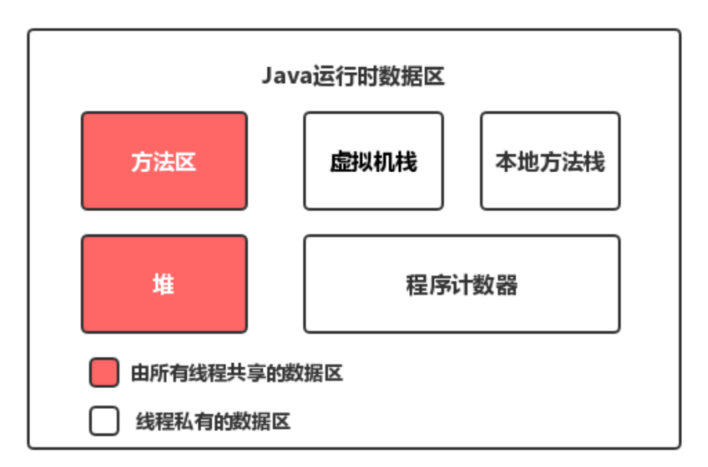
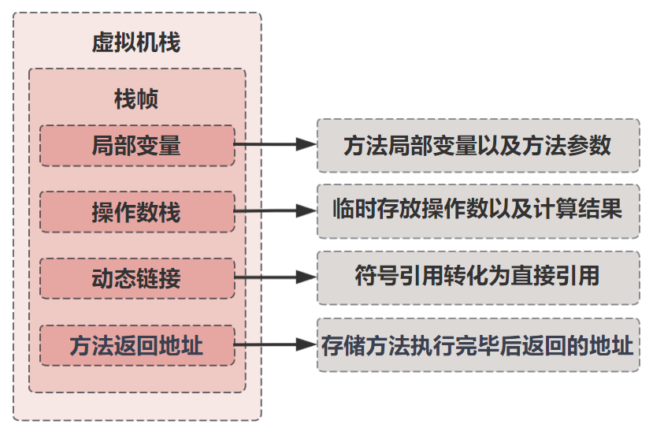
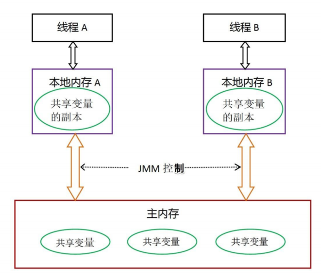

### 一、Java运行时数据区
Java运行时内存区域描述的是在JVM运行时，如何将内存划分为不同的区域，以及每个区域的功能和工作机制。

- 方法区：存储类信息、域信息(域名称、域类型、域修饰符等)、方法信息、静态变量、运行时常量池等等。
- 堆：存储对象实例，数组，基本数据类型等。**堆是存储的单位。**
- 虚拟机栈：存储方法调用的参数、方法体内的局部变量、返回地址、对象的引用、异常处理器参数等。**栈是运行时的单位。**
- 本地方法栈：存储JNI(Java Native Interface)方法调用的参数、返回值等。管理本地方法的调用。
- 程序计数器：存储当前线程正在执行的字节码地址。

### 二、Java的内存模型（JMM）
Java内存模型（Java Memory Model，JMM）是一组规则，定义了Java程序中的变量、线程如何和主内存以及工作内存进行交互。

从抽象的角度来说，JMM定义了线程和主内存之间的抽象关系：

1. 所有的共享变量都存在主内存中。
2. 每个线程都保存了一份该线程使用到的共享变量的副本。
3. 如果线程A与线程B之间要通信的话，必须经历下面2个步骤： 
   
    i. 线程A将本地内存A中更新过的共享变量刷新到主内存中去。

    ii. 线程B到主内存中去读取线程A之前已经更新过的共享变量。

**所以，线程A无法直接访问线程B的工作内存，线程间通信必须经过主内存。**

> 注意：根据JMM的规定  ，线程对共享变量的所有操作都必须在自己本地内存中进行，不能直接从主内存中读取。

### 三、JMM与Java运行时数据区的区别

- 区别
    
  两者是不同的概念。
  - JMM是抽象的，用来描述一组规则，通过这个规则来控制各个变量的访问方式，围绕原子性、可见性、有序性等展开。
  - Java运行时内存的划分是具体的，是JVM运行Java程序时必要的内存划分。
    
- 联系
    
    都存在私有数据区域和共享数据区域。 JMM的主内存属于共享数据区域，包含了堆和方法区；本地内存属于私有数据区域，包含了虚拟机栈、本地方法栈、程序计数器等。