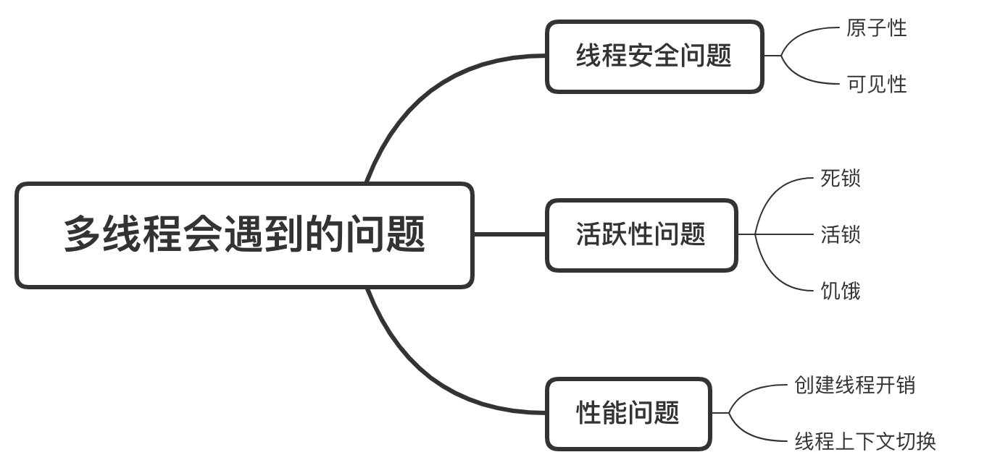
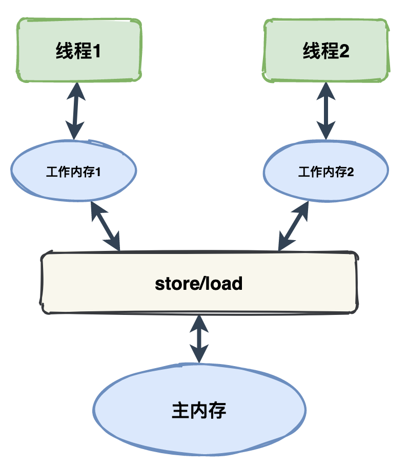
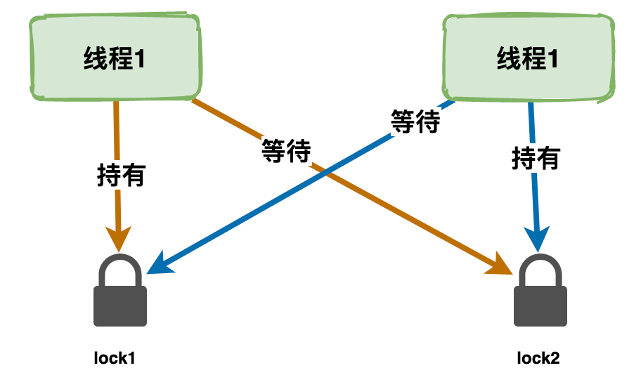
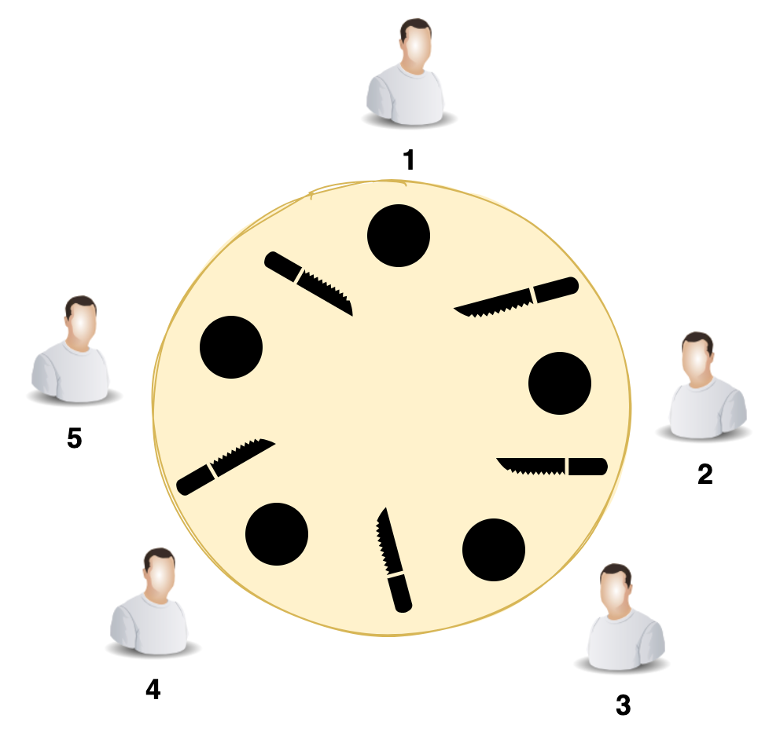
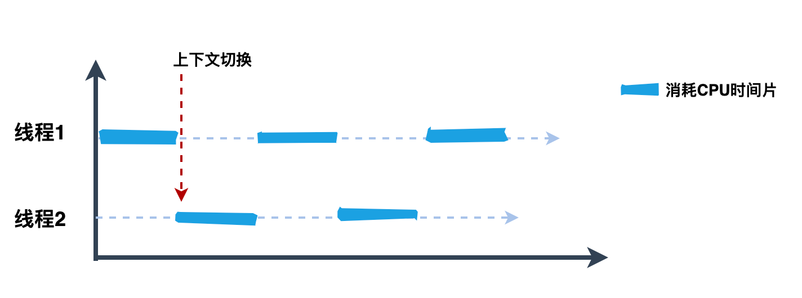

多线程遇到的问题归纳起来就三类：线程安全问题、活跃性问题、性能问题。

## 一、线程安全问题

线程安全问题：原子性、可见性、活跃性。

### 1.1 原子性

原子性：指的是一个操作或者多个操作，要么全部执行且执行的过程不会被任何因素打断，要么全部不执行。

原子操作：不会被线程调度机制打断的操作，没有上下文切换。

### 1.2 可见性

可见性：当多个线程访问同一个变量时，一个线程修改了这个变量的值，其他线程能够立即看得到修改的值。

每个线程都有属于自己的工作内存，工作内存和主内存间需要通过store和load等进行交互。

为了解决多线程的可见性问题，Java提供了volatile关键字，当一个共享变量被volatile修饰时，它会保证修改的值立即更新到主内存中。
这样的话，当有其他线程需要读取时，就会从内存中读取到新值。普通的共享变量不能保证可见性，因为变量被修改后什么时候刷回到主内存是不确定的，因此另外一个线程读到的可能就是旧值。

## 二、活跃性问题

活跃性：某件正确的事情最终会发生，但当某个操作无法继续下去的时候，就会发生活跃性问题。

活跃性问题一般有这几类：死锁、活锁、饥饿问题。

**死锁**

死锁是指多个线程因为环形等待锁的关系而永远地阻塞下去。

**活锁**

活锁是两个线程都在等待对方释放锁导致阻塞。活锁的意思是线程没有阻塞，还活着呢。

当多个线程都在运行且都在修改各自的状态，而其他线程又依赖这个状态，就导致任何一个线程都无法继续执行，只能重复自身的动作，所以就发生了活锁。

**饥饿**

如果一个线程无其他异常却迟迟不能继续运行，那基本上是处于饥饿状态了。

有一个非常经典的饥饿问题就是哲学家用餐问题，如下图所示，有五个哲学家在用餐，每个人必须要同时拿两把叉子才开始就餐，如果哲学家 1 和哲学家 3 同时开始就餐，那哲学家 2、4、5 就得饿肚子等待了。

## 三、性能问题

创建线程开销+线程上下文切换

创建线程是直接向系统申请资源的，对操作系统来说，创建一个线程的代价是十分昂贵的，需要给它分配内存、列入调度等。

线程创建完之后，还会遇到线程上下文切换。

CPU 是很宝贵的资源，速度非常快，为了保证雨露均沾，通常会给不同的线程分配时间片，当 CPU 从执行一个线程切换到执行另一个线程时，CPU 需要保存当前线程的本地数据，程序指针等状态，并加载下一个要执行线程的本地数据，程序指针等，也就是『上下文切换』。