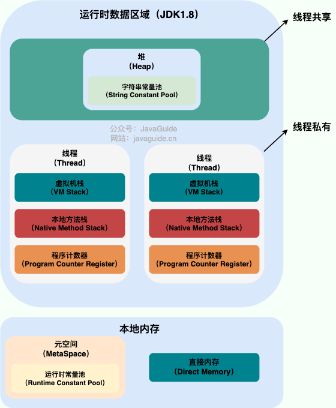

### 一、线程和进程的关系
- 进程：是对运行时程序的封装，是系统进行资源调度和分配的基本单位，实现了操作系统的并发。
- 线程：是进程的子任务，是 CPU 调度和分派的基本单位，实现了进程内部的并发。

换个方式理解：
- 进程：打开一个浏览器，这个浏览器就相当于是一个进程。
- 线程：在浏览器种打开的 n 多个页面，这些页面就相当于是多个线程。

> 一句话概况就是：**线程是操作系统资源，而进程是应用程序资源。**

### 二、Java线程和操作系统的线程有什么区别？

JDK 1.2 之前，Java 线程是基于绿色线程（Green Threads）实现的，这是一种用户级线程（用户线程），也就是说 JVM 自己模拟了多线程的运行，而不依赖于操作系统。由于绿色线程和原生线程比起来在使用时有一些限制（比如绿色线程不能直接使用操作系统提供的功能如异步 I/O、只能在一个内核线程上运行无法利用多核），在 JDK 1.2 及以后，Java 线程改为基于原生线程（Native Threads）实现，也就是说 JVM 直接使用操作系统原生的内核级线程（内核线程）来实现 Java 线程，由操作系统内核进行线程的调度和管理。

其中，用户线程和内核线程的区别：
- 用户线程：由用户空间程序管理和调度的线程，运行在用户空间（专门给应用程序使用）。
- 内核线程：由操作系统内核管理和调度的线程，运行在内核空间（只有内核程序可以访问）。

简单总结下两者的区别和特点：用户线程创建和切换的成本低，但是不可以利用多核；而内核线程创建和切换成本高，但是可以利用多核。

> 一句话概况就是：现在的 Java 线程的本质其实就是操作系统的线程。

###  三、从JVM角度分析线程与进程的关系

一个进程中可以有多个线程，多个线程共享进程的堆和方法区资源，但是每个线程都有自助机的程序计数器、虚拟机栈和本地方法栈。

**总结**： 线程是进程划分成的更小的运行单位。线程和进程最大的不同在于基本上各进程是独立的，而各线程则不一定，因为同一进程中的线程极有可能会相互影响。线程执行开销小，但不利于资源的管理和保护；而进程正相反。

### 四、程序计数器为什么是私有的？
程序计数器主要有下面两个作用：
1. 字节码解释器通过改变程序计数器来依次读取指令，从而**实现代码的流程控制**，如：顺序执行、选择、循环、异常处理。
2. 在多线程的情况下，程序计数器用于记录当前线程执行的位置，从而当线程被切换回来的时候能够知道该线程上次运行到哪儿了。需要注意的是，如果执行的是 native 方法，那么程序计数器记录的是 undefined 地址，只有执行的是 Java 代码时程序计数器记录的才是下一条指令的地址。所以，程序计数器私有**主要是为了线程切换后能恢复到正确的执行位置**。

### 五、虚拟机栈和本地方法栈为什么是私有的？

- 虚拟机栈：每个 Java 方法在执行之前会创建一个栈帧用于存储局部变量表、操作数栈、常量池引用等信息。从方法调用直至执行完成的过程，就对应着一个栈帧在 Java 虚拟机栈中入栈和出栈的过程。
- 本地方法栈：和虚拟机栈所发挥的作用非常相似，区别是：虚拟机栈为虚拟机执行 Java 方法 （也就是字节码）服务，而本地方法栈则为虚拟机使用到的 Native 方法服务。 在 HotSpot 虚拟机中和 Java 虚拟机栈合二为一。所以，**为了保证线程中的局部变量不被别的线程访问到**，虚拟机栈和本地方法栈是线程私有的。

### 六、堆和方法区

堆和方法区是所有线程共享的资源，其中堆是进程中最大的一块内存，主要用于存放新创建的对象 (几乎所有对象都在这里分配内存)，方法区主要用于存放已被加载的类信息、常量、静态变量、即时编译器编译后的代码等数据。

