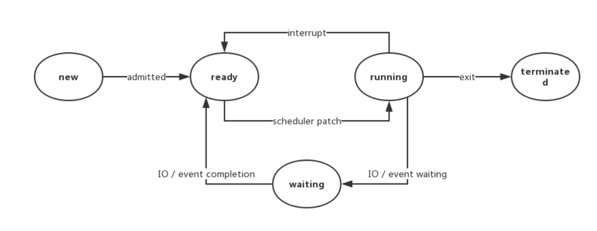

现在的 Java 线程的本质其实就是操作系统的线程。

现在的操作系统被视为轻量级进程的，所以操作系统线程的状态其实和操作系统进程的状态是一致的。
### 一、操作系统的线程状态
操作系统的线程状态包括：
1. 就绪状态（ready）：线程正在等待使用CPU，经调度程序调用后进入running状态；
2. 执行状态（running）：线程正在运行，正在使用CPU；
3. 等待状态（waiting）：线程正在等待某个事件的调用或等待其他资源，如文件I/O结束。

### 二、线程的6种状态

Java 线程在运行的生命周期中的指定时刻只可能处于下面 6 种不同状态的其中一个状态：
1. NEW: 初始状态，线程被创建出来但没有被调用 start() 。
2. RUNNABLE: 运行状态，线程被调用了 start() 等待运行的状态，其实包含了操作系统线程的 ready 和 running 两个状态。
3. BLOCKED：阻塞状态，需要等待锁释放。
4. WAITING：等待状态，表示该线程需要等待其他线程做出一些特定动作（通知或中断）（Object.wait()/Thread.join()/LockSupport.park()）。
5. TIMED_WAITING：超时等待状态，可以在指定的时间后自行返回而不是像 WAITING 那样一直等待（Thread.sleep(long millis)/Object.wait(long timeout)/Thread.join(long millis)/LockSupport.parkNanos(long nanos)/LockSupport.parkUntil(long deadline)）。
6. TERMINATED：终止状态，表示该线程已经运行完毕。

下面是由6种状态引申出来的问题:
1. 反复调用一个线程的 start() 方法是否可行？
    
    不行，在调用 start() 之后，threadStatus 的值会改变（treadStatus != 0），再次调用 start() 方法会抛出 IllegalThreadStateException 异常。

2. 假如一个线程执行完毕（此时处于 TERMINATED 状态）是否可以再次调用 start() 方法？
   
    threadStatus 为 2 代表当前线程状态为 TERMINATED。

### 三、线程6种状态的切换

1. 线程创建之后它将处于 NEW（新建） 状态，调用 start() 方法后开始运行，线程这时候处于 READY（可运行） 状态。可运行状态的线程获得了 CPU 时间片（timeslice）后就处于 RUNNING（运行） 状态。
2. 当线程执行 wait() 方法之后，线程进入 WAITING（等待） 状态。进入等待状态的线程需要依靠其他线程的通知才能够返回到运行状态。
3. TIMED_WAITING(超时等待) 状态相当于在等待状态的基础上增加了超时限制，比如通过 sleep（long millis）方法或 wait（long millis）方法可以将线程置于 TIMED_WAITING 状态。当超时时间结束后，线程将会返回到 RUNNABLE 状态。
4. 当线程进入 synchronized 方法/块或者调用 wait 后（被 notify）重新进入 synchronized 方法/块，但是锁被其它线程占有，这个时候线程就会进入 BLOCKED（阻塞） 状态。
5. 线程在执行完了 run() 方法之后将会进入到 TERMINATED（终止） 状态。

### 四、什么是线程上下文切换？

线程在执行过程中会有自己的运行条件和状态（也称上下文），比如上文所说到过的程序计数器，栈信息等。当出现如下情况的时候，线程会从占用 CPU 状态中退出。
- 主动让出 CPU，比如调用了 sleep(), wait() 等。
- 时间片用完，因为操作系统要防止一个线程或者进程长时间占用 CPU 导致其他线程或者进程饿死。
- 调用了阻塞类型的系统中断，比如请求 IO，线程被阻塞。
- 被终止或结束运行。

这其中前三种都会发生线程切换，线程切换意味着需要保存当前线程的上下文，留待线程下次占用 CPU 的时候恢复现场。并加载下一个将要占用 CPU 的线程上下文。这就是所谓的 上下文切换。上下文切换是现代操作系统的基本功能，因其每次需要保存信息恢复信息，这将会占用 CPU，内存等系统资源进行处理，也就意味着效率会有一定损耗，如果频繁切换就会造成整体效率低下。

